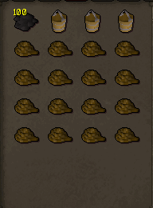

## Fishing Trawler Solo-player Guide
### Notes
* You require level 15 fishing to play this minigame.
* This minigame is not 100% authentic.

### Inventory Setup

* 100-200 Swamp Paste
* 3-4 Bailing Buckets
* 12-16 Ropes

### Playing the game
When you first start the game you'll be prompted with a brief tutorial telling you  
what each item does. You should plug leaks as fast as possible as the boat  
can fill with water very quickly. Occasionally, the net will rip. Go on the top deck  
and inspect the net in order to repair it. If your net is good and all leaks  
are already plugged, spam click your bailing buckets to remove water as fast as  
possible.

### Rewards
Our fishing trawler has all the authentic rewards, including:
* Raw Shrimp
* Raw Sardine
* Raw Anchovie
* Raw Lobster
* Raw Manta Ray
* Raw Sea Turtle
* Raw Sharks
* Various Junk Items

However, somewhat inauthentically, I wanted to make this minigame  
somewhat worth doing, as in its vanilla state it is pretty much  
pointless. So all the above fish can be caught at any level, and  
there's been a few inauthentic rewards added. Those are as follows:
* Loop half of key
* Tooth half of key
* Caskets (can award gems, coins, talismans, and a few other things)
* Pirate's Hat (very rare)
* Lucky Cutlass (very rare)

### Experience
I tweaked how experience is gained as well, again to make this somewhat worth doing.
The exact formula for experience gained at x1 xp is:  
`((1.5% of Fishing Level) * Fishing Level) * Number of Fish Caught`
 
What this generally works out to mean is that at level 99, you get roughly 
20k experience per trip at x1 xp at level 99, and 438.75 xp per trip at x1  
at level 15. These are both based on catching around 130 fish, which is the expected  
average when soloing. 

### Other players
Playing with more players is more relaxed but you get less fish  
and xp, as the haul is divided evenly between all players.